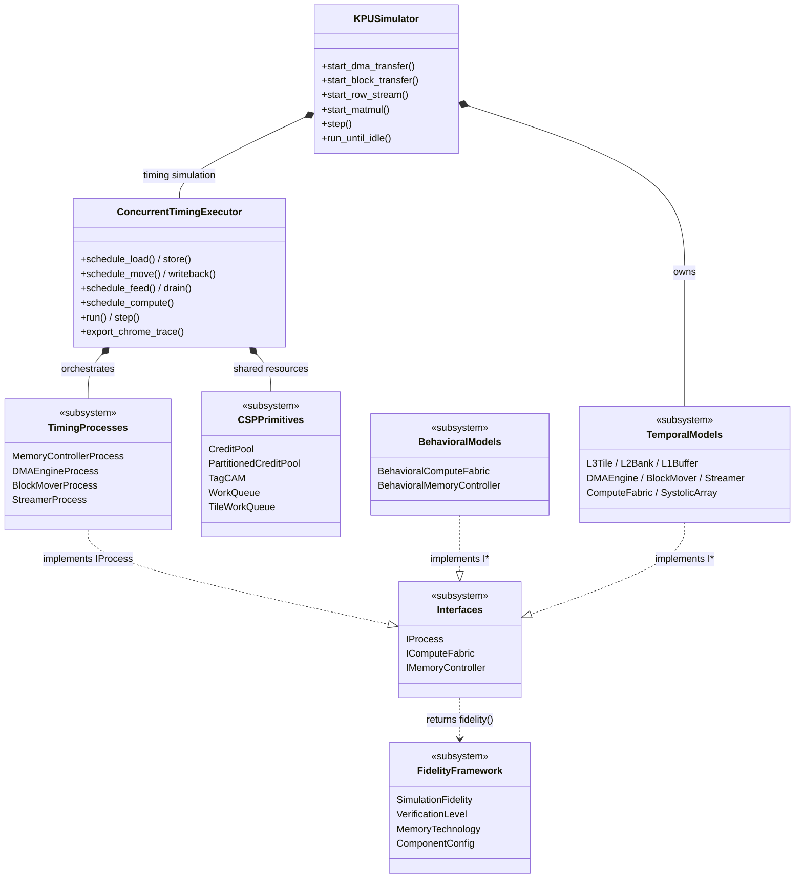
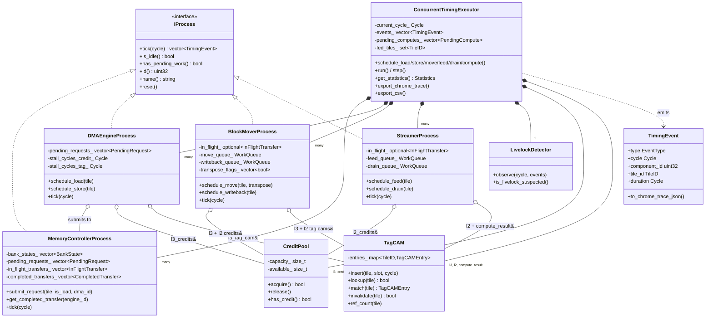
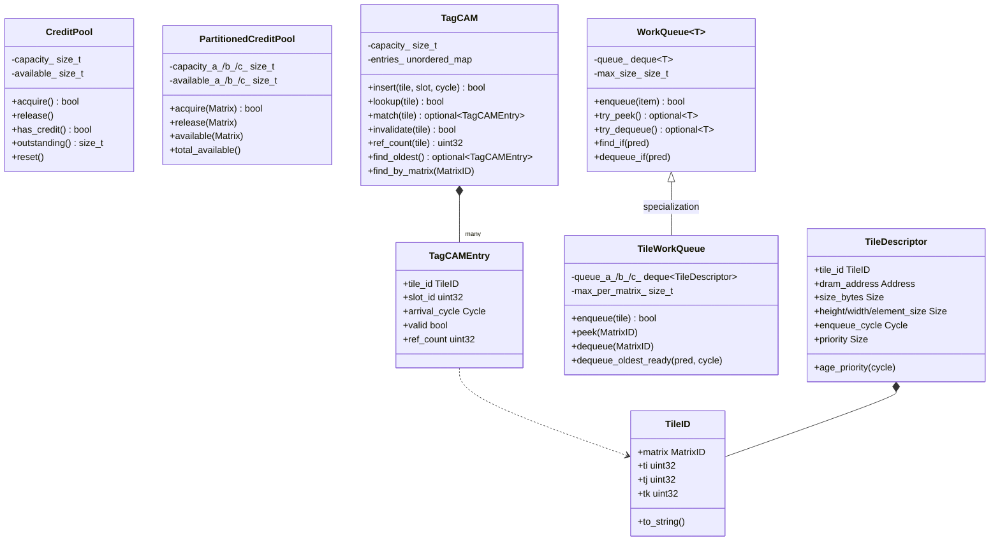
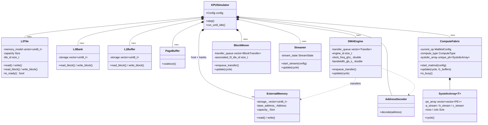
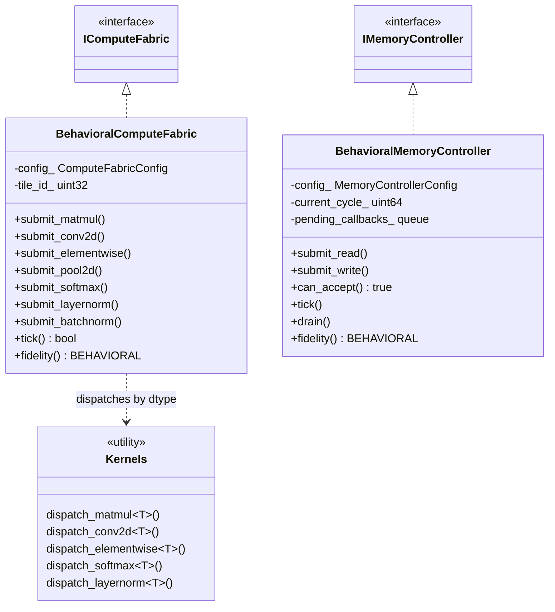
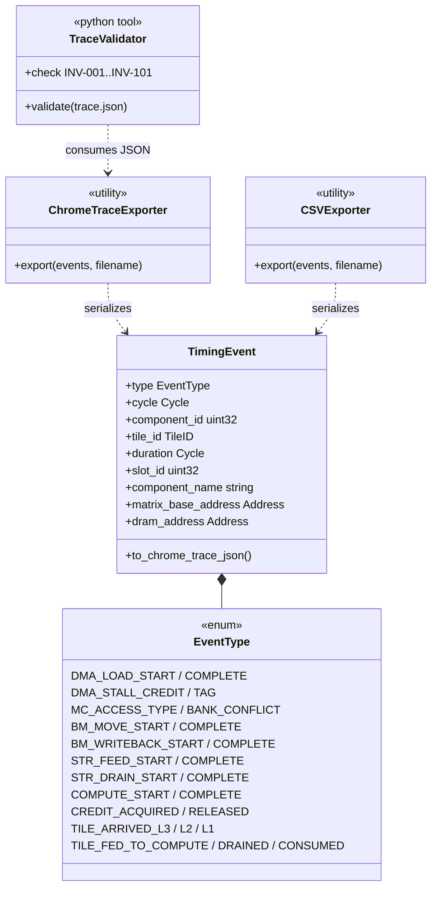

# KPU Simulator — UML Class Diagrams

Layered class diagrams of the KPU simulator as of the current `main` branch. Each
diagram is scoped to a single subsystem so it stays readable. Start with the
**Overview** to see how the layers fit together, then drill into any subsystem.

Diagram conventions (Mermaid):

- `*--` composition (owns by value or `unique_ptr`)
- `o--` aggregation (holds a reference / non-owning pointer)
- `<|--` inheritance
- `<|..` interface realization
- `..>` dependency / uses

---

## 1. Overview — Top-Level Architecture

---

## 2. Timing / CSP — Credit-Based Dataflow Core

The credit-based dataflow simulator. Per `docs/kpu-execution-model.md`: credits flow
**UP**, data flows **DOWN**. Each process implements `IProcess::tick()` and emits
`TimingEvent`s. Shared `CreditPool`s and `TagCAM`s are owned by the executor and
held by reference inside each process.

**Tick order:** `MC.tick() → DMA.tick() → BlockMover.tick() → Streamer.tick()`
(MC first so completions are visible to DMA the same cycle).

---

## 3. CSP Primitives

Reusable credit-flow building blocks. `PartitionedCreditPool` and `TileWorkQueue`
partition resources across the A/B/C matrix dimensions to prevent livelock.

---

## 4. Interfaces & Fidelity Framework

Multi-fidelity is enforced via interfaces that every implementation reports its
fidelity through. Concrete implementations live in `behavioral/` (instant),
`temporal/` (cycle-accurate), and `timing/` (CSP processes).

```mermaid
classDiagram
    class SimulationFidelity {
        <<enum>>
        BEHAVIORAL
        TRANSACTIONAL
        CYCLE_ACCURATE
    }

    class VerificationLevel {
        <<enum>>
        NONE
        ASSERTIONS
        INVARIANTS
        PROTOCOL
    }

    class MemoryTechnology {
        <<enum>>
        IDEAL
        LPDDR5 / LPDDR5X
        DDR5
        HBM2 / HBM2E / HBM3
        GDDR6 / GDDR7
    }

    class ComponentConfig {
        +memory_fidelity SimulationFidelity
        +compute_fidelity SimulationFidelity
        +dma_fidelity SimulationFidelity
        +noc_fidelity SimulationFidelity
        +verification_level VerificationLevel
        +memory_technology MemoryTechnology
    }

    class IComputeFabric {
        <<interface>>
        +submit_matmul()
        +submit_conv2d()
        +submit_elementwise()
        +submit_pool2d()
        +submit_softmax()
        +submit_layernorm()
        +tick() bool
        +is_busy() bool
        +fidelity() SimulationFidelity
    }

    class IMemoryController {
        <<interface>>
        +submit_read()
        +submit_write()
        +can_accept() bool
        +tick()
        +drain()
        +current_cycle() uint64
        +fidelity() SimulationFidelity
        +technology() MemoryTechnology
        +get_bank_state(ch, bank) BankState
        +is_row_open(ch, bank, row) bool
    }

    class IProcess {
        <<interface>>
        +tick(cycle) vector~TimingEvent~
        +is_idle()
        +has_pending_work()
        +reset()
    }

    class BehavioralComputeFabric
    class BehavioralMemoryController
    class TemporalComputeFabric
    class TemporalMemoryController
    class MemoryControllerProcess
    class DMAEngineProcess
    class BlockMoverProcess
    class StreamerProcess

    IComputeFabric <|.. BehavioralComputeFabric
    IComputeFabric <|.. TemporalComputeFabric
    IMemoryController <|.. BehavioralMemoryController
    IMemoryController <|.. TemporalMemoryController
    IProcess <|.. MemoryControllerProcess
    IProcess <|.. DMAEngineProcess
    IProcess <|.. BlockMoverProcess
    IProcess <|.. StreamerProcess

    ComponentConfig *-- SimulationFidelity
    ComponentConfig *-- VerificationLevel
    ComponentConfig *-- MemoryTechnology
    IComputeFabric ..> SimulationFidelity
    IMemoryController ..> SimulationFidelity
    IMemoryController ..> MemoryTechnology
```

---

## 5. Temporal Tier — Functional / Cycle-Accurate Models

These are the components owned directly by `KPUSimulator` for the value-computing
behavioral execution path. They model actual memory contents and perform actual
matrix arithmetic.

---

## 6. Behavioral Tier — Instant / Functional Models

The fast path used for software bring-up. Behavioral models complete operations
in zero or fixed cycles and compute actual numerical results.

---

## 7. Trace / Visualization Output

Cycle-accurate runs export Chrome Trace JSON and CSV for visualization. The
`TimingEvent` is the unit of trace data emitted by every `IProcess` per tick.

---

## File Map

| Diagram | Primary source files |
|---|---|
| Overview | `include/sw/kpu/kpu_simulator.hpp` |
| Timing/CSP | `include/sw/kpu/timing/{concurrent_timing_executor, *_process, process_interface}.hpp` |
| CSP Primitives | `include/sw/kpu/timing/{credit_pool, tag_cam, work_queue, tile_descriptor}.hpp` |
| Interfaces & Fidelity | `include/sw/kpu/fidelity/*.hpp`, `include/sw/kpu/models/interfaces/*.hpp` |
| Temporal | `include/sw/kpu/models/temporal/{memory, datamovement, compute}/*.hpp` |
| Behavioral | `include/sw/kpu/models/behavioral/{compute, memory}/*.hpp` |
| Trace | `include/sw/kpu/timing/process_interface.hpp` (TimingEvent), exporters in `ConcurrentTimingExecutor` |
