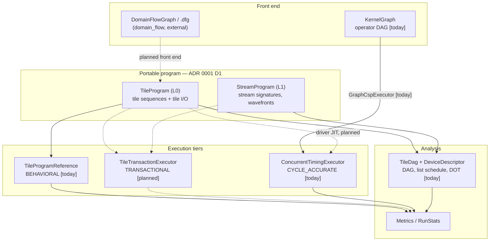
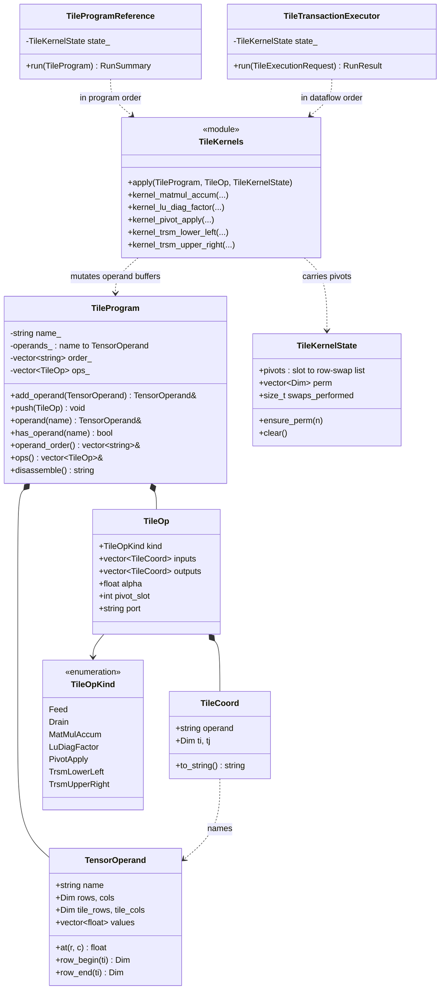
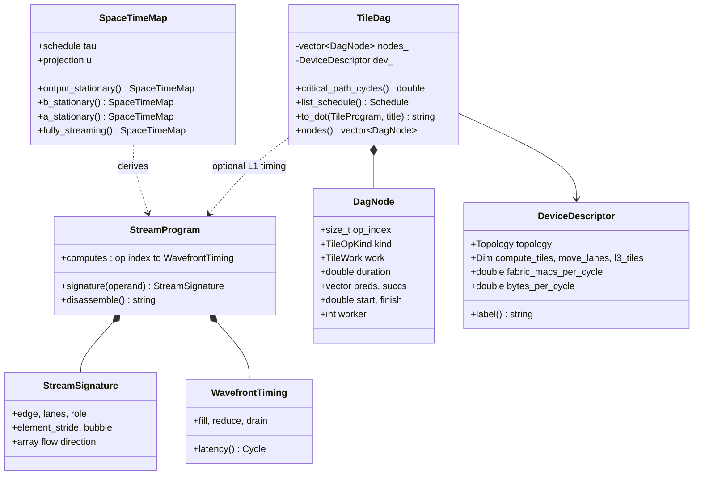
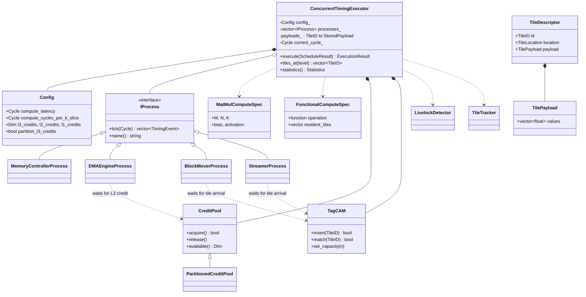
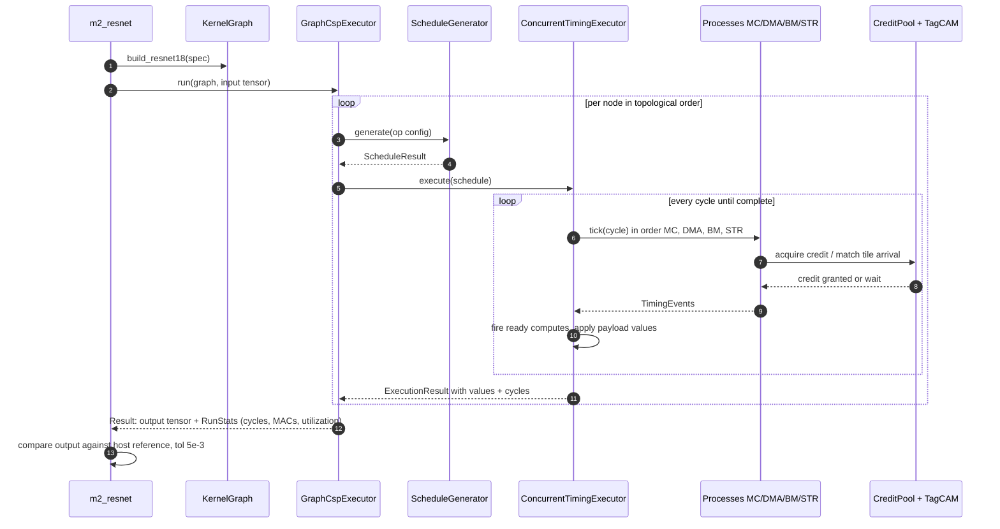
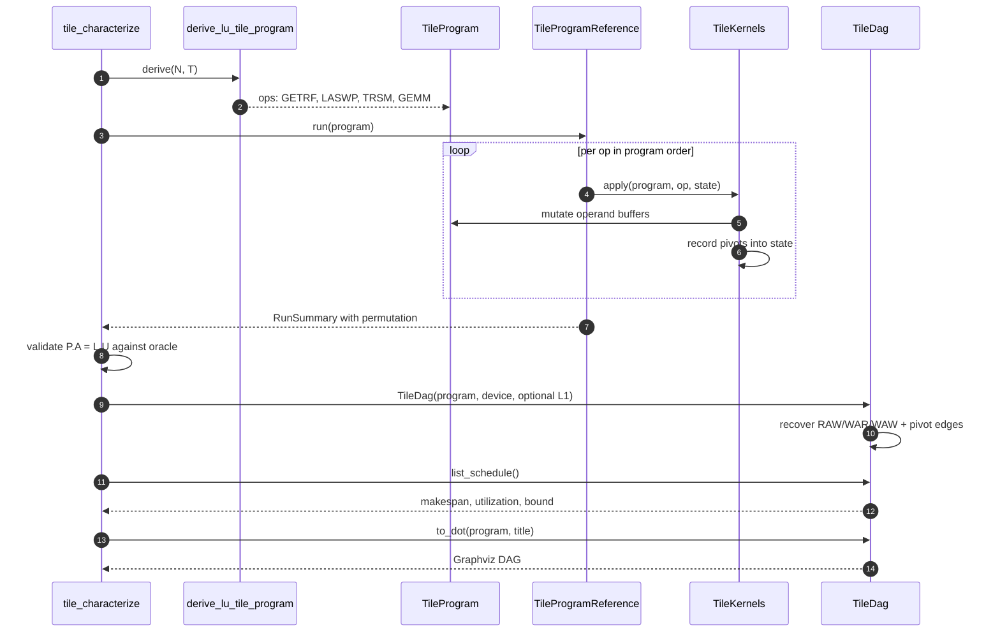
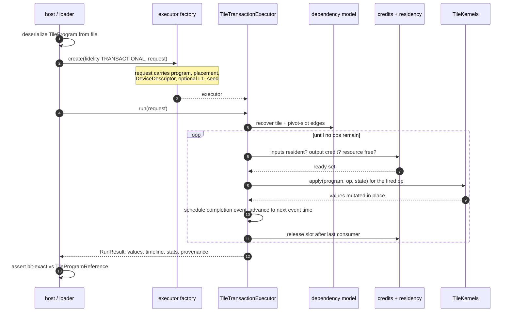

# UML — how the classes deliver a simulated domain-flow program execution

**Scope:** the classes that turn a domain-flow program into a simulated execution, and how
they collaborate. Companion to `docs/architecture/class-diagram.md` (hardware components)
and `docs/architecture/adr/0001-program-contract-and-transactional-engine.md` (which
engine owns which tier).

**How to read it.** Everything marked **[today]** exists and runs. Everything marked
**[planned]** is decided in ADR 0001 but not yet built, and is drawn dashed. The frozen
engines (the DMProgram executors, the OFG flow executors — ADR 0001 D6) are deliberately
absent: they are not part of the path forward.

---

## 1. The stack at a glance

Two program layers exist today, reaching two different execution tiers. ADR 0001 makes the
L0 program the single portable one, so the left column becomes the front end of the right.

The one gap worth naming: today `KernelGraph` reaches the cycle-accurate tier directly,
while `TileProgram` reaches only the reference and the analysis harness. Closing that —
one program, three tiers — is what ADR 0001 decided and what #264 and #265 implement.

---

## 2. The portable program (L0/L1) and its drivers

**The load-bearing relationship** is the pair of dashed arrows into `TileKernels`. Both
drivers call **one** kernel implementation and differ only in the order they choose and
what they measure, which is what makes the transactional tier bit-identical to the oracle
by construction rather than by testing (ADR 0001 D3.1, delivered by #270).

`TileKernelState` is the other subtlety: it carries a pivot decision from `LuDiagFactor` to
the `PivotApply` ops that replay it. That is the data-dependent control GEMM does not have,
and the reason a driver may not reorder ops past their pivot-slot edges.

### L1 and the analysis layer

`TileDag` recovers the dependency DAG from each op's **declared tile I/O** — RAW/WAR/WAW
over tiles, plus the pivot-slot edges. That recovery is the shared foundation: the
analysis harness list-schedules it, `to_dot` draws it, and the planned executor fires
against it.

---

## 3. The cycle-accurate tier (CSP)

This is the credit-based dataflow model in class form: a producer pushes only when it holds
a **credit** from downstream, and consumers return credits upstream. `TagCAM` is how a
component waits for a **tile arrival** out of order. No component fetches on demand.

### What drives it

```mermaid
classDiagram
    class IScheduleGenerator {
        <<interface>>
        +generate(config) ScheduleResult
    }
    class MatMulScheduleGenerator
    class Conv2DScheduleGenerator
    class PoolingScheduleGenerator
    class BatchNormScheduleGenerator
    class OnlineSoftmaxScheduleGenerator
    class OnlineReductionScheduleGenerator
    class ScheduleResult {
        +vector~ScheduleOperation~ operations
        +ScheduleMetadata metadata
    }
    class ScheduleOperation {
        +OpKind kind
        +tile, feed, resident
    }
    class ScheduleExecutor {
        +execute(ScheduleResult) ExecutionResult
    }
    class GraphCspExecutor {
        +run(KernelGraph, input, ...) Result
    }
    class Result {
        +vector~float~ output
        +RunStats stats
    }
    class FunctionalMLPExecutor {
        +add_layer(...)
        +run(input) vector~float~
    }
    class FunctionalSoftmaxExecutor
    class FunctionalElementwiseExecutor
    class FunctionalReductionExecutor
    class ScheduleValidator {
        +validate_livelock_safety(...)
    }

    IScheduleGenerator <|-- MatMulScheduleGenerator
    IScheduleGenerator <|-- Conv2DScheduleGenerator
    IScheduleGenerator <|-- PoolingScheduleGenerator
    IScheduleGenerator <|-- BatchNormScheduleGenerator
    IScheduleGenerator <|-- OnlineSoftmaxScheduleGenerator
    IScheduleGenerator <|-- OnlineReductionScheduleGenerator
    IScheduleGenerator ..> ScheduleResult : produces
    ScheduleResult *-- ScheduleOperation
    ScheduleExecutor ..> ScheduleResult : consumes
    ScheduleExecutor ..> ConcurrentTimingExecutor
    GraphCspExecutor ..> IScheduleGenerator : per node
    GraphCspExecutor ..> ConcurrentTimingExecutor
    GraphCspExecutor ..> Result : returns output + stats
    FunctionalMLPExecutor ..> ConcurrentTimingExecutor
    FunctionalSoftmaxExecutor ..> ConcurrentTimingExecutor
    FunctionalElementwiseExecutor ..> ConcurrentTimingExecutor
    FunctionalReductionExecutor ..> ConcurrentTimingExecutor
    ScheduleValidator ..> ScheduleResult : checks envelope
```

---

## 4. Sequence — a DNN graph on the cycle-accurate tier [today]

How `m2_resnet` actually executes. Each node runs on a fresh executor and the statistics
are summed, so cross-op residency is not modelled — a known limitation, not a drawing
simplification.

## 5. Sequence — an L0 tile program today [today]

What `tile_characterize` does, and where `--dot` and the shared kernels sit.

## 6. Sequence — the target transactional execution [planned]

The path ADR 0001 decided and #264/#265 implement. Note where it differs from §5: the
program arrives **from a file**, and ops fire on credits and residency instead of in
program order.

---

## 7. Where each class lives

| Class | Header |
|---|---|
| `TileProgram`, `TensorOperand`, `TileOp`, `TileCoord`, `TileOpKind` | `include/sw/kpu/program/tile_program.hpp` |
| `TileKernelState`, `apply`, `kernel_*` | `include/sw/kpu/program/tile_kernels.hpp` |
| `TileProgramReference` | `include/sw/kpu/program/tile_program_reference.hpp` |
| `StreamProgram`, `StreamSignature`, `SpaceTimeMap`, `WavefrontTiming` | `include/sw/kpu/program/stream/stream_signature.hpp` |
| `TileDag`, `DagNode` | `include/sw/kpu/program/characterize/tile_dag.hpp` |
| `DeviceDescriptor`, `Topology` | `include/sw/kpu/program/characterize/device_model.hpp` |
| `ConcurrentTimingExecutor`, `Config`, compute specs | `include/sw/kpu/timing/concurrent_timing_executor.hpp` |
| `IProcess` and the four processes | `include/sw/kpu/timing/*_process.hpp` |
| `CreditPool`, `PartitionedCreditPool`, `TagCAM`, work queues | `include/sw/kpu/timing/{credit_pool,tag_cam,work_queue}.hpp` |
| `TileDescriptor`, `TilePayload`, `TileID`, `Cycle` | `include/sw/kpu/timing/tile_descriptor.hpp` |
| `IScheduleGenerator`, `ScheduleResult`, `ScheduleOperation` | `include/sw/kpu/timing/schedule/schedule_generator_interface.hpp` |
| `ScheduleExecutor`, functional executors | `include/sw/kpu/timing/schedule/` |
| `GraphCspExecutor`, `RunStats`, model specs | `include/sw/kpu/timing/graph/` |
| `KernelGraph`, `KernelNode`, `KernelEdge` | `include/sw/kpu/kernel_graph.hpp` |
| `TileTransactionExecutor`, `Placement` **[planned]** | `docs/plans/tile-transaction-executor.md` |

## 8. Deliberate omissions

- **The DMProgram/ISA path** (`BehavioralProgramExecutor`, `TransactionalProgramExecutor`,
  `ProgramSerializer`, `kpu-loader`) is frozen under ADR 0001 D6. `.kpubin` remains the
  driver-JIT output, so it will reappear in a future diagram as the JIT's product, not as a
  program the user hands the simulator.
- **The OFG flow executors** (`include/sw/kpu/models/dataflow/`) are omitted: their
  `execute_operation` is a no-op, so they compute nothing.
- **The driver JIT and placement pass** (#230 increment 3) are shown only as the source of
  `Placement` in §6; their internal classes do not exist yet.
