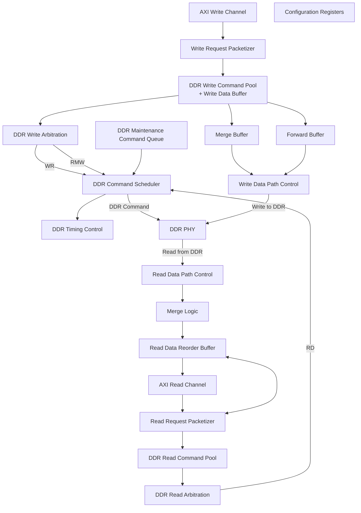

# Memory Controller Case Study

There are many ways to implement DDR memory controllers, and we show one possible implementation as a case study.

As shown below, on one side, a DDR memory controller takes read and write requests from system fabric. The source of these requests can be CPUs, SoC bus masters, or IO devices. For easy of integration with standard SoC ecosystems, we assume the system fabric follows AXI protocols.

The DDR memory controller interacts with DDR devices through DDR-PHY (Dual Data Rate Physical Layer). Functionally, DDR-PHY converts parallel single-rate data from memory controller into serial dual-rate data streams for transmission over the DDR memory interface and vice versa. It is also in charge of DDR device calibration and initialization.

Interpretation:

  - System Fabric: CPU, DMA, accelerators, interconnect
  - DDR Memory Controller: protocol handling, scheduling, arbitration
  - DDR PHY: electrical/physical interface
  - DDR Device: external DRAM

---

## Detailed Micro-architecture

The following diagram shows the DDR memory controller top level architecture.

The controller will decode the incoming AXI requests into DDR burst aligned packets, 
and decode the AXI address into the DRAM address (Channel, Rank, Chip, Bank Group, Bank, Row, Column.). The address decoding logic should interrogate the request sequences as to find opportunities to reorder and interleave the memory commands to minimize bank conflicts and maximize efficiency.

Write requests are stored in the Write Command Pool, and the associated write data is stored in the Write Data Buffer. Once the write packets are pushed into the DDR Write Command Pool, the controller will return AXI Write Responses. This significantly improves the write latency for the issuer as they do not need to wait for full retirement into the DRAM device memory cells.

Once a DDR write packet / command is sent to DDR, the associated write data in the Write Data Buffer is written to the PHY. The Write Data Path Control shall unpack the write data and count write latency.

Certain DDR devices do not support partial write, and a Read-Modify-Write (RMW) operation is required. RMW will first issue a DDR read command to the same address, and DDR read data is sent back to the Write Data Buffer for merging. Finally, a full DDR write command with the merged line is issued.

DDR read requests are pushed to the Read Command Pool, assuming both the Read Command Pool and the Read Data Reorder Buffer have space available. If either one has no space left, the Read Request Packetizer excerts backpressure on the AXI Read Channel.

After a DDR read packet / command is sent to DDR, the Read Data Path Control is responsible for collecting read data from DDR and packing data into the Read Data Reorder Buffer.

A typical DDR memory controller will provide out-of-order read data responses, as allowed by AXI protocols. The controller still requires the Read Data Reorder Buffer since:

The Read Data Reorder Buffer makes sure the read data responses are in order, for AXI read requests with the same AXI ID, as required by AXI protocols
One AXI read request may be divided into multiple DDR burst aligned packets, and DDR packets may be scheduled out-of-order. The Read Data Reorder Buffer must assemble the read data from DDR, and provide the data response for the original AXI read request
